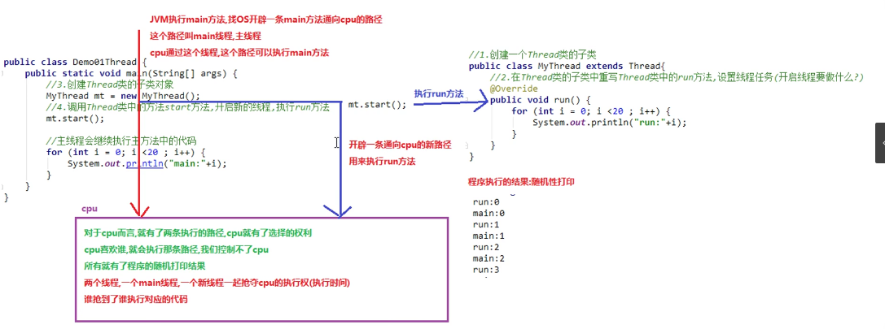
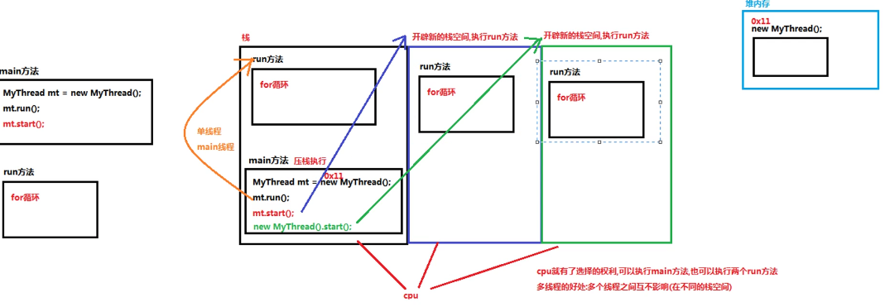
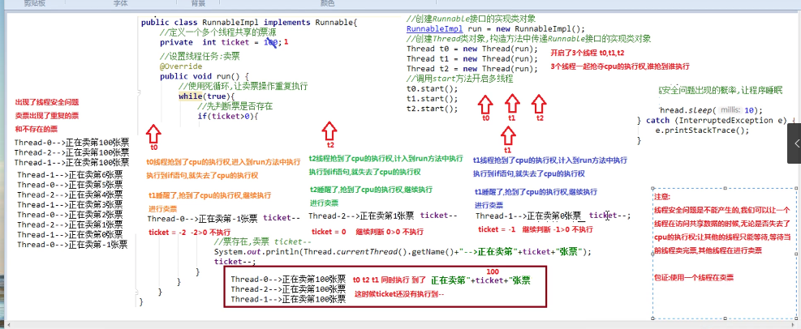
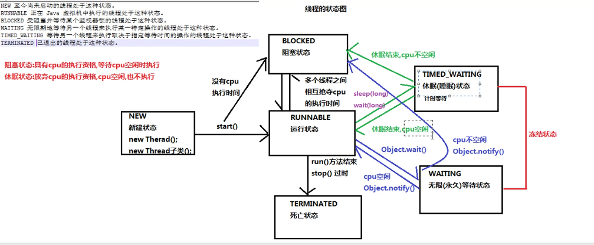

## 多线程

## 概念
	并行 : 同一时刻
	并发 : 一段时间内(交替执行)

	进程 : 一个应用程序
	线程 : 进程中的一个执行单元，负责程序的执行。 一个进程至少有一个线程 
		*点击运用程序功能，就会开启一条应用程序到cpu的执行路径(线程) 
	主线程 : 执行main()方法的线程
	单线程程序 : 只有一个的程序
	

## 创建多线程 java.lang.Thread
	*consturctor
	 Thread(Runnable target) 
		Allocates a new Thread object. 
	 Thread(Runnable target, String name) 
		Allocates a new Thread object. 

	1.声明为Thread类的子类，并重写Thread的run方法. 创建该子类对象调用start()方法启动线程
		class PrimeThread extends Thread {
         long minPrime;
         PrimeThread(long minPrime) {
             this.minPrime = minPrime;
         }

         public void run() {
             // compute primes larger than minPrime
              . . .
         }
    	}
	The following code would then create a thread and start it running: 

     PrimeThread p = new PrimeThread(143);
     p.start();
	2.实现Runnable接口类，重写run方法
		class MyThread implements Runnable(){
		
		public void run(){}

		}

		Mythread p = new Mythread(); 
		new Thread(p).start();
		
		*Runnable与Thread区别
			Runnable好处
			1.避免单继承的局限性
				一个类只能继承一个类，而实现Runnable可以继承其他类
			2.降低程序的耦合性
				将设置线程任务与开启新线程进行了分离
	3.匿名内部类实现多线程创建
		简化代码 : 把子类继承父类，重写父类方法，创建实现类对象合成一步完成
		因此它的最终产物为子类/实现类对象
		格式 : 
			new 父类/接口(){
			重复父类/接口中的方法	
			}
		
		* new Thread(){
			public void run() {
			..
		 	}
		 }.start();
		
		* Runnable r = new RunnableImpl() 多态
			Runnable r = new Runnable(){
			public void run(){....}
			};
		 new Thread(r).start();
		 new Thread(new Runnable(){
			public void run(){....}
			};).start();
## 多线程原理

## 多线程内存图解

## Thread类方法
	1.获取线程的名称
		1.使用Thread类中getName()
			String getName() 写在新线程run方法中
		2.在线程中使用  currentThread()获取线程对象
			对象调用getName方法
			sout(new MyThread.currentThread().getName())
	2.设置线程名字 
		1.void setName(String name)
		2.创建线程带参构造方法，传递给Thread
			public MyThread(String name)
				{
					super(name);
				} 
	3.暂停线程多少毫秒，暂停结束后继续执行
		public static void sleep(long millis)
		Thread.sleep(1000);
		

## 线程安全
	多线程访问了共享的数据产生的线程安全问题
	买票案例 TicketDemo1.java RunnableImpl.java
	
*产生线程问题的原理

解决办法 : 一个线程访问共享资源时，让其他线程等待(无论是否获得cpu执行权)

## 线程同步
	解决线程安全问题
	1.同步代码块
		** TicketDemo2.java RunnableImpl.java
		synchronized(同步锁){
			需要同步的代码
		}
	注意 :
   		1.同步锁对象可以是任意对象
		2.必须保证多个线程的锁对象是同一个
		3.锁对象作用 : 锁住同步代码块，只让一个线程在同步代码块中执行
	同步技术的原理 :
		*锁对象=对象所=对象监视器
		*多个线程一起抢夺cpu的执行权，谁先抢到谁先执行run方法
			t0抢到执行权 ，执行run方法，发现synchronized代码块，这时t0检查synchronized代码块是否有锁对象，有，获取锁对象，进入同步执行，没有，则进入阻塞状态，等待其他线程执行完毕同步代码块代码，然后归还锁对象
	2.同步方法
		** TicketDemo3.java RunnableImp2.java
		1.将访问了共享数据的代码抽取出来，放到一个方法中
		2.在方法上添加synchronized修饰符
		同步方法的锁对象 : 就是实现类对象 new RunnableImpl()
		
		*静态同步方法	 : 
			1.锁对象 : 不能是this 实现类对象
				因为静态方法优先于对象
			它的锁对象是 本类的class属性-->class文件对象(反射)
	3.Lock锁 java.util.concurrent.locks interface 
		** TicketDemo4.java RunnableImp3.java
		lock锁中的方法 :
			1.void lock() 获取锁
			2.void unlock() 释放锁
		实现类 : java.util.concurrent.locks.ReetrantLock
		步骤 : 
			1.在成员位置创建一个ReetrantLock对象
			2.在可能出现线程安全问题代码前调用Lock接口中的方法Lock()
			3.在可能出现线程安全问题代码后调用Lock接口中的方法unLock()

## 线程状态

	Waiting 无限等待状态 : 一个正在无限等待另一个线程执行一个特别的(唤醒)动作的线程处于这一状态
	
	** 等待唤醒案列 : 线程之间的通信
		顾客要买包子，和老板说明包子的数量和种类
		顾客就等待老板做包子(调用waiting方法) Waiting状态
		老板做包子，做好告诉顾客，调用notify()方法
	
		注意 : 
			1.顾客与老板必须使用同步代码块包括起来，以保证等待和唤醒只有一个在执行。
			2.同步锁对象必须保证唯一
			3.只有锁对象才能调用wait与notify方法

		Object方法 :
		void wait() 
			Causes the current thread to wait until another thread invokes the notify() method or the notifyAll() method for this object. 
		void wait(long timeout) //计时等待方法
			Causes the current thread to wait until either another thread invokes the notify() method or the notifyAll() method for this object, or a specified amount of time has elapsed. 
		void notify() 
			Wakes up a single thread that is waiting on this object's monitor. 
		void notifyAll() 
			Wakes up all threads that are waiting on this object's monitor. 
