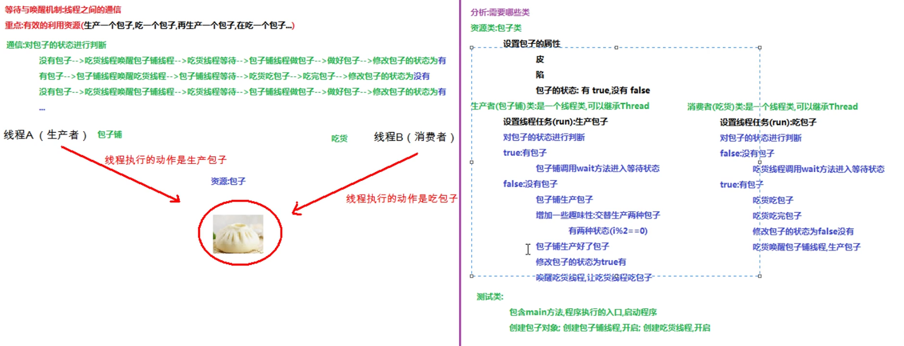

##等待与唤醒机制 线程间通信
	概念 : 多个线程在处理同一个资源，但处理的动作不相同
	*希望多个线程有规律的执行，需要线程通信
	*通过等待唤醒机制来保证线程有效通信

	*线程通线案例实现 :

	Demo.java
	Baozi.java
	ChiHuo.java
	Productor.java

##线程池:
	线程容器 : ArrayList;LinkedList<Thread>
	原理 :
	1.程序启动时创建多个线程，保持到集合中
		add(new Thread(xxx))
	2.使用线程时，取出线程
		list.remove(0);返回被移除的元素
		Thread t = Linked.removeFirst();
	3.使用完毕归还线程
		list.add(t);
		linked.addLast(t);

##jdk1.5之后提供线程池 :
	java.util.concurrent.Executors 线程池的工厂类
	1.方法
		static ExecutorService newFixedThreadPool(int nThreads) 
		*Creates a thread pool that reuses a fixed number of threads operating off a shared unbounded queue. 
	2.返回值 
		ExecutorService接口，返回的时ExecutorService接口的实现类对象，可以使用接口接收(面向接口编程)
	3.java.util.concurrent.ExecutorService 线程池接口，用来从线程池中获取线程，调用start方法执行线程任务
		Future<?> submit(Runnable task) 
		Submits a Runnable task for execution and returns a Future representing that task 
## 线程池使用步骤
	1.执行线程池工厂类中的静态方法 static ExecutorService newFixedThreadPomm(int nThread)生产指定数目的线程
	2.创建类实现Runnbale接口，重写run方法，设置线程任务
	3.掉用ExecutorServie中的方法submit，传递线程任务(实现类)，开启线程，执行run方法
	4.调用ExecutorService中的shutdown销毁线程池(不建议使用)

	线程池会一直开启，使用完线程，会自动把线程归还给线程池，线程可以继续使用。

## Lambda表达式
	1.两种思想
		面向对象思想 : 做一件事情，找一个能解决这个事情的对象，调用对象的方法完成事情
		函数式编程思想 : 只要能获取结果，不关心如何做，重视结果，不重视过程
	2.编程思想转换
		做什么，而不是怎么做。
		如从北京到上海，可以选择汽车，高铁...我们真正的目的时到上海，不关系如何到，所以我们一直探索有没有比高铁更好的方式.
		*jdk1.8中，加入lanbda表达式的重量级新特性
	3.标准格式
		a.一些参数 : 需要重写的方法的参数
		b.一个箭头 : 将参数传递给方法体
		c.一段代码 : 方法体 
			(参数列表) -> {重写方法的代码}
	*简化匿名内部类的书写 (接口中只有一个抽象方法) 
		
		arrays.sort(arr,new Comparator<person>(){
			public int compare(Person 01,person 02){
			return 01.getAge()-02.getAge();
			}
		});
		//简化 明确重写哪一个方法 Comparator
		arrays.sort(arr,(Person 01,person 02)->{
			return 01.getAge()-02.getAge();
			});
		});
		for (Person p : arr){
		sout(p);
		}

简写核心-------要有一个内容去占位
1.可以省略参数类型，因为就只有一个抽象方法，会自动匹配抽象方法中的参数类型
2.当方法体中只有一句代码语句时，可以省略{}。如果有返回值，省略的话要同时省略{}和return。
3.当只有一个参数时，可以**省略（）**号
4.如果在lambda表达式中引用了局部变量，默认使用final修饰。因为接口中的常量默认都使用public static final修饰的，所有在函数式接口中使用了过后，默认也会有final修饰

