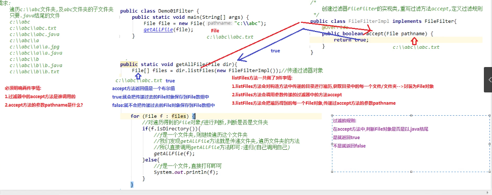

## File类 java.io.File
	把文件与目录封装为file类，对文件与目录进行增删改查操作.
	创建，删除，获取，判断文件
	对文件夹进行遍历，获取文件的大小
	file类是一个与系统无关的类。 

## File类静态成员变量
	static String pathSeprator 路径分隔符号 
		window ;  linux :
	static char pathSeprator 系统有关路径分隔符·
	static String separator 文件名称分隔符
	static char separator   系统有关；默认名称分隔符
		winodow 反斜杠\ linux /
	操作路径 : 不能写死 用于不同系统
		如 "c:"+File.separator+"hr"
			c:\\User\hr
			路径中的文件名称分隔符window使用反斜杠，反斜杠时转义字符，两个反斜杠代表一个普通的反斜杠
## File类的构造方法
	1.File (String pathname);
		路径可以是文件结尾，也可以是文件夹结尾
		路径可以相对路径，也可以是绝对路径
		路径可以存在，也可以不存在
		File类只是将字符串路径封装为File对象
	2.File(String parent,String child)
		String parent :  父路径
		String child : 子路径
		父路径和子路径，可以单独书写，可以变化，使用起来更灵活
		 如:new File(d:\\,a.txt);
	2.File(File parent,String child)
		File parent :  父路径
		String child : 子路径
		父路径是File类型，可以使用File类方法对路径进行操作，再使用路径创建对象 
		如 : File parent = new File("c:\\");
			 File file = new File(parent.xxx,"a.txt");
## File类方法
	1.获取功能的方法
		public String getAbsolutePath();
		public String getPath(); 将此File转换为路劲文件名
		public String getName();
		public long length();   返回此File表示的文件的长度
	2.判断功能的方法
		public boolean exists();
		public boolean isDirectory();
		public boolean isFile();
		先判断文件是否存在。文件不存在，后两个方法返回false
	3.创建删除功能的方法
		public boolean createNewFile();
		1.此方法只能文件，不能创建文件夹
		2.文件路径必须存在。不存在抛出异常
		3.声明抛出io异常
		public boolean delete();
		返回false :	
			1.文件夹中有内容，不会输出
			2.文件不存在
		注意 : 该方法直接删除，不走回收站
		public boolean mkdir(); 创建由此File表示的目录
		public boolean mkdirs(); 可以创建多极文件夹
		路劲不存在，不会创建，不会抛异常
	4.File类遍历
		public String[] list(); 返回一个String数组，表示该File目录中的所有子文件或目录.
		public File[] listFiles(); 返回一个File数组，表示该File目录中的所有的子文件或目录.
		2.如果构造方法中给出的路径不存在，会抛出空指针异常
		3.如果路径不是一个目录，也会抛出空指针异常.
## 递归
	1.概念 :方法自己调用自己的现象
		分为直接递归和间接递归(a调b，b调a)两种
	2.注意事项 :
		1.有一定的条件限定，保证递归能够停下来。否则发生栈内存溢出
		2.递归次数不能太多
		3.构造方法，禁止递归
	3.使用前提
		当调用方法的时候，方法的主体不变，每次调用方法的参数不同

	*案例
	递归打印多级目录
	文件结尾查询
	public boolean endsWith(String str);

## 文件过滤器
	File类中有两个重载的方法，方法的参数传递的就是过滤器
	1.File[] listFiles(FileFilter filter)
	 	1.作用 :java.io.FileFilter接口 : 用于抽象路径名File对	象过滤器
		2.方法 : 
			boolean accept(File pathname) 测试指定的抽象路	径名是否应包含在路径名列表中。
			参数 : 
				File pathname : 使用ListFiles方法遍历目录。得到的每一个文件对象
	2.File[] listFiles(FilenameFilter filter)
		1.文件名称过滤器
		2.抽象方法
			boolean accept(File dir, String name)
			参数 :
 				File dir : 构造方法中传递的被遍历的目录
				Name : 使用ListFiles方法遍历目录。得到的每一个文件的名称
	3.两个方法没有实现类。需要自己编写实现类，重写方法定义过滤规则，或者使用匿名内部类。	
		
过滤器原理 : 

	