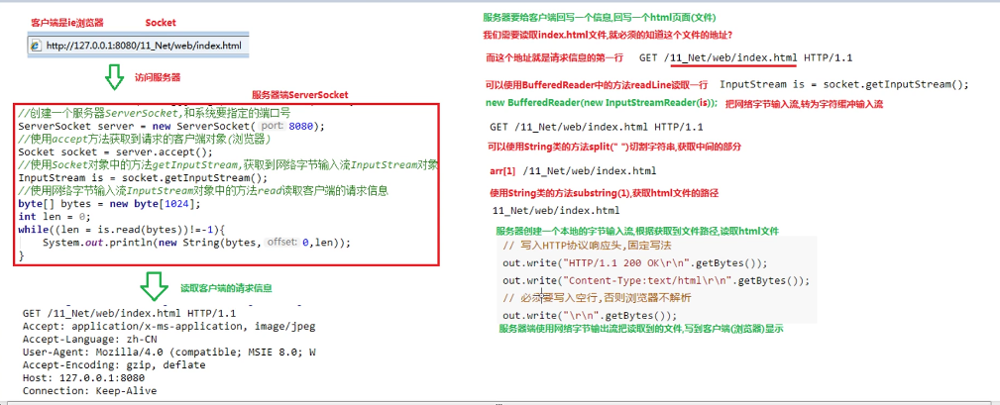

## 网络通信协议
	位于同一网络中的计算机在进行连接与通信时，必须遵守一定的规则。
	这些规则被称为协议。
### Tcp/ip协议
	传输控制协议/因特网互联协议
### 协议分类
	java.net 
	1.UDP 用户数据报协议，面向无连接的通信协议。消耗资源小，通信效率高，通常用于音频，视频会议等。不能保证数据完整性 限制64kb大小
	2.TCP 传输控制协议 面向连接通信协议 保证数据安全 文件下载网页浏览
### 默认端口号
	1.80端口号 网络端口 
	2.数据库 mysql 3306 oracle 1521
	3.Tomcat 8080
## Tcp通信
	1.tcp实现两台计算机的数据交互，严格区客户端与服务器端。
	2.客户端与服务器端建立的逻辑连接，这个连接包含一个IO对象 字节流
	3.Socket类表客户端 ServerSocket类表服务器端 
	4.客户端与服务器端进行一个数据交换，需要4个IO流对象
	5.服务器端通过accept方法可以获取到请求的客户端对象
	6.服务器实际上没有IO流对象，服务器获取到请求的各个客户端Socket对象，使用客户端各自Socket中提供的IO流和客户端进行交互
### Socket类
	java.net.Socket 
	套接字 : 包含了IP地址和端口号的网络单位
	1.构造方法
		Socket(String host, int port) 
			Creates a stream socket and connects it to the specified port number on the named host.
		host : 服务器主机的名字/ip地址
		port : 端口号
	2.成员方法
		InputStream getInputStream() 
			Returns an input stream for this socket
		OutputStream getOutputStream() 
			Returns an output stream for this socket  
		void close() 
			Closes this socket.
	3.使用步骤 客户端
		1.创建Socket对象,构造方法传递服务器的ip地址和端口号
		2.使用Socket对象中的getOutputStream()获取网络字节输出流对象
		3.使用OutnputStream()对象中的write方法。给服务器发送数据
		4.使用Socket对象中的getInputStream()获取网络字节输出流对象
		5.使用InputStream()对象中的read方法，读取服务器回写数据
		6.释放资源
	4.注意事项
		1.客户端与服务器进行交互，必须使用socket提供的网络流，不能使用自己创建的流对象
		2.当我们创建客户端Socket对象时，就会取请求服务器，和服务器经过3次握手建立连接通路。如果服务器未启动，就会抛出异常

### ServetSocket类 服务器套接字
	1.构造方法
		ServerSocket(int port) 
			Creates a server socket, bound to the specified port
		服务器端必须明确知道时那个客户端请求的服务器，使用accept方法获取客户端Socket
	2.成员方法
		Socket accept() 
			Listens for a connection to be made to this socket and accepts it.
	3.使用步骤
		1.创建ServerSocket对象指定端口号
		2.使用该对象的accept方法，获取Socket对象
		3.使用Socket对象中的getInputStream()获取网络字节输入流对象
		4.使用InputStream()对象中的read方法，读取客户端发送数据
		5.使用Socket对象中的getOutputStream()获取网络字节输出流对象
		6.使用OutnputStream()对象中的write方法。给客户端发送数据

### 文件上传案例
	1.客户端读取本地文件，把文件上传到服务器
	2.服务器再把上传的文件保存到硬盘上.

	注意 :
		1.读取本地文件用自己创建的流
		2.客户端与服务器交流用Socket网络字节流
		3.服务器存储文件使用本地文件流
	!!!循环读取 文件很大

#### 文件上传案例阻塞问题
	1.发现程序未停止
	2.原因 :
	read()方法 This method blocks if no input is yet available.
	bis.read(bytes) 读取本地文件，结束标记是读取到-1时结束
	while循环会读取到-1? 不会，不会把结束标记-1写入数组，因此服务器端的while循环read方法进入阻塞状态.
	3.解决办法:
	手动写入一个结束标记给服务器
	java.net.Socket 
	void shutdownOutput()  禁用套接字输出流
		Disables the output stream for this socket. 
		Disables the output stream for this socket. For a TCP socket, any previously written data will be sent followed by TCP's normal connection termination sequence.
#### 优化
	1.防止文件重复 : 覆盖
		String filename = "XXX"+System.currentTimeMillis()+new Random().nextInt(99999)+".jpg"
		规则 : 域名+毫秒值+随机数

	2.让服务器一直处于监听状态 :
		死循环accept方法
	3.使用多线程技术提高效率
		有一个用户上传文件就开启一个线程

## BStcp/ip实现

	问题 : 无法显示图片

	原因:浏览器解析服务器回写的html页面，页面中如果有图片，那么浏览器就会单独的开启一个线程，读取服务器的图片时，我们就让服务器一直处于监听状态，客户端请求一次，服务器就回写一次。

	解决办法 : 让服务器一直处于监听状态 且开启多线程