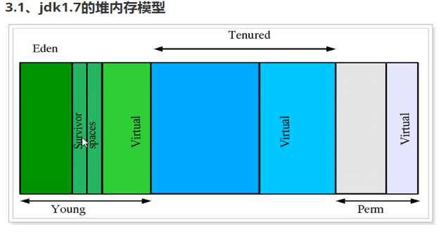
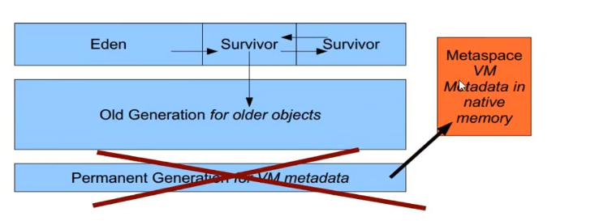
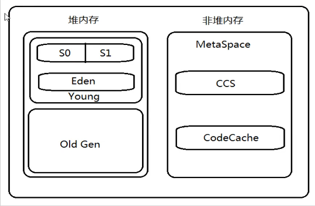

# JVM优化 (1.8)

## 1.为什么要对jvm优化
 * 运行的应用"卡住了"，程序没有反应
 * cup负载提高
 * 多线程应用中，如何对调配线程
 
## 2.JVM运行参数
### 2.1三种参数标准
 * **标准参数**(未来JVM版本中不会发生改变)
	 * -help
	 * -version
	 * -D<名称>=<值> 设置系统属性参数
	
**练习:通过-D设置系统属性参数**
	
	public class TestJvm{
		public static void main(String[] agrs)
			String str = System.getProperty("Str");
			System.out.println(str);
	}

	java -Dstr=hello
	运行结果 hello

 * **-X参数**(非标准参数) 版本不用可能命令可能有所不同
 	* `-Xint` interpreted mode 解释模式 强制jvm逐行执行所有字节码
 	* `-Xcomp` 编译模式 jvm在第一次使用时会把所有的字节码编译为本地代码，第一次执行会慢一些
 	* `-Xmixed` jvm自己决定使用解释模式还是编译模式
 * **-XX参数** 非标准类型 用于jvm的调优和debug操作
	* 2种使用方式，一种boolean类型，一种非boolean类型
		* boolean类型
			* 格式 : `-XX:[+/-]<name>`表示启用或禁用<name>属性 * ex: -XX:+DisableExplicitGC表示禁用手动调用gc操作，即System.gc()//(通知垃圾回收器回收)无效
		* 非boolean类型
			* 格式 `-XX:<name>=<value>`表示<name>属性值为<value>
			* ex: -XX:NewRatio=1 //表示为1	* **-Xms/-Xmx**	设置jvm的堆内存的初始大小和最大大小
		* `-Xmx2048m/-XX:MaxHeapSize` 最大堆内存20148m 
### 2.2查看jvm运行参数
	
 * 进行参数打印	
 
		root@[hr]# java -XX:+PrintFlagsFinal XXX(class文件名)   

 * 查看jvm某进程所有运行参数
		
		root@[hr]# jinfo -flags <进程id>
	
 * 查看某进程id(如tomcat)
	
	 	root@[hr]# ps -ef|grep tomcat
		root@[hr]# jps 查看与jvm相关进程id	 

## 3.jvm内存模型
	jvm内存模型1.7和1.8有较大区别，虽然我们以1.8为例讲解，但首先我们应该先对1.7内存模型有所了解
### 3.1 jdk1.7堆内存模型

`Young年轻区(代)`分为`Eden区`和两个大小严格相同的`Survivor区`
	
**工作原理:** 其中survivor区，某一时刻只有其中一个是被使用的，另一个留作垃圾回收时复制对象使用，当Eden区间变满时，GC就会将存活的对象移到空闲的Survivor区，根据JVM策略，经过几次垃圾收集后，依然存活的对象将被移动到`Tenured区`

`Tenured年老区`存放一些老的对象，多次未被回收的对象

`Perm永久代`主要保存一些不会被回收的对象以保证基础项目运行如class，method，filed对象

`Virtual区`最大内存和初始内存的差值

### 3.2 jdk1.8堆内存模型

 * 与1.7区别:没有Perm永久代，由Metasapce元数据区取代

上图可以看出，1.8的堆内存模型由2部分组成 年轻代+年老代

**注意:**Metaspace所占用的内存空间不是在虚拟机内部，而是在**本地内存空间中**
