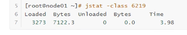
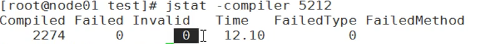
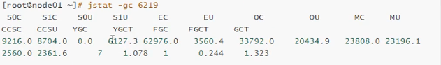
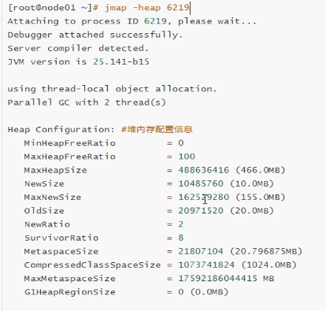
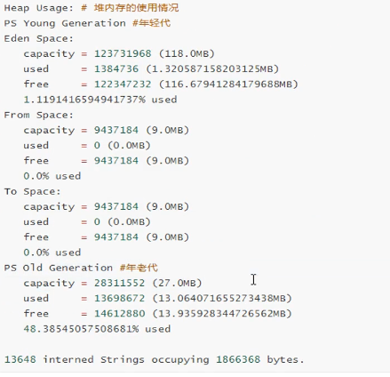
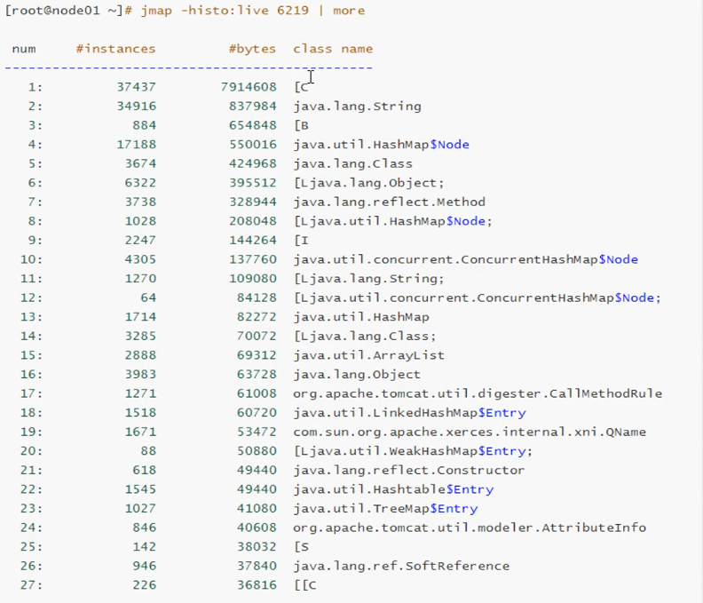
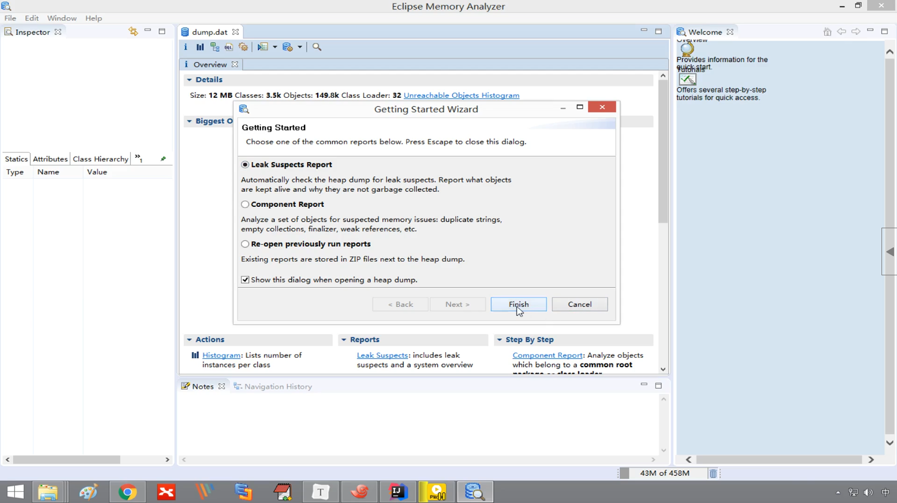
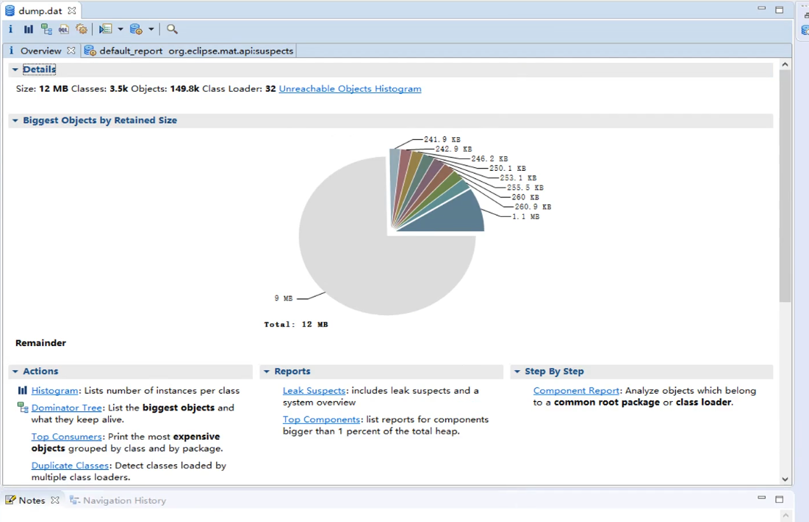

# JVM优化 (1.8)

## 1.为什么要对jvm优化
 * 运行的应用"卡住了"，程序没有反应
 * cup负载提高
 * 多线程应用中，如何对调配线程
 
## 2.JVM运行参数
### 2.1三种参数标准
 * **标准参数**(未来JVM版本中不会发生改变)
	 * -help
	 * -version
	 * -D<名称>=<值> 设置系统属性参数
	
**练习:通过-D设置系统属性参数**
	
	public class TestJvm{
		public static void main(String[] agrs)
			String str = System.getProperty("Str");
			System.out.println(str);
	}

	java -Dstr=hello
	运行结果 hello

 * **-X参数**(非标准参数) 版本不用可能命令可能有所不同
 	* `-Xint` interpreted mode 解释模式 强制jvm逐行执行所有字节码
 	* `-Xcomp` 编译模式 jvm在第一次使用时会把所有的字节码编译为本地代码，第一次执行会慢一些
 	* `-Xmixed` jvm自己决定使用解释模式还是编译模式
 * **-XX参数** 非标准类型 用于jvm的调优和debug操作
	* 2种使用方式，一种boolean类型，一种非boolean类型
		* boolean类型
			* 格式 : `-XX:[+/-]<name>`表示启用或禁用<name>属性 * ex: -XX:+DisableExplicitGC表示禁用手动调用gc操作，即System.gc()//(通知垃圾回收器回收)无效
		* 非boolean类型
			* 格式 `-XX:<name>=<value>`表示<name>属性值为<value>
			* ex: -XX:NewRatio=1 //表示为1	* **-Xms/-Xmx**	设置jvm的堆内存的初始大小和最大大小
		* `-Xmx2048m/-XX:MaxHeapSize` 最大堆内存20148m 
### 2.2查看jvm运行参数
	
 * 进行参数打印	
 
		root@[hr]# java -XX:+PrintFlagsFinal XXX(class文件名)   

 * 查看jvm某进程所有运行参数
		
		root@[hr]# jinfo -flags <进程id>
	
 * 查看某进程id(如tomcat)
	
	 	root@[hr]# ps -ef|grep tomcat
		root@[hr]# jps 查看与jvm相关进程id	 

## 3.jvm内存模型
	jvm内存模型1.7和1.8有较大区别，虽然我们以1.8为例讲解，但首先我们应该先对1.7内存模型有所了解
### 3.1 jdk1.7堆内存模型

`Young年轻区(代)`分为`Eden区`和两个大小严格相同的`Survivor区`
	
**工作原理:** 其中survivor区，某一时刻只有其中一个是被使用的，另一个留作垃圾回收时复制对象使用，当Eden区间变满时，GC就会将存活的对象移到空闲的Survivor区，根据JVM策略，经过几次垃圾收集后，依然存活的对象将被移动到`Tenured区`

`Tenured年老区`存放一些老的对象，多次未被回收的对象

`Perm永久代`主要保存一些不会被回收的对象以保证基础项目运行如class，method，filed对象

`Virtual区`最大内存和初始内存的差值

### 3.2 jdk1.8堆内存模型

 * 与1.7区别:没有Perm永久代，由Metasapce元数据区取代

上图可以看出，1.8的堆内存模型由2部分组成 年轻代+年老代

**注意:**Metaspace所占用的内存空间不是在虚拟机内部，而是在**本地内存空间中**

**ccs区:** 类的压缩指针

**CodeCache区:** 类class

### 3.3 为什么要废弃jdk1.7的永久区

* 移除永久代是为了融合HotSpot JVM与JRockit vm而做出的努力，因为JRockit没有永久代
* 现实使用中，由于永久代内存经常不够用或发生内存泄漏，爆出异常java.lang.OutOfMemoryError:PermGen.基于此，将永久区废弃，改用元空间,使用本地内存空间. 

### 3.4 通过jstat命令进行查看堆内存使用情况
* jstat命令可以查看堆内存各部分的使用量，以及加载类的数据。
	
		jstat[-命令选项][vmid进程id][间隔时间/毫秒][查询次数]
		
#### 3.4.1 查看class加载统计

	root@[hr]# jstat -class 5212

	说明:
    * loaded:加载class的数量
	* Bytes:所占用空间大小
	* Unloaded:未加载数量
	* Bytes:为加载占用空间
	* Times:时间

#### 3.4.2 查看编译统计
	root@[hr]# jstat -compiler 5212

	说明:
    * Compiled:编译数量
	* Failed:失败数量
	* Invalid:不可用数量
	* Times:时间
	* FailedType:失败类型
	* FailedMethod:失败的方法

#### 3.4.2 查看垃圾回收统计
	root@[hr]# jstat -gc 5212

	说明:
    * S0C:第一个Survivor区的大小
	* S1C:第二个Survivor区的大小
	* S0U:第一个Survivor区的使用大小
	* S0U:第二个Survivor区的使用大小
	* EC:Eden区的大小
	* EU:Eden区的使用大小
	* OC:Old区大小
	* OU:Old区的使用大小
	* MC:方法区大小
	* MU:方法区使用大小
	* CCSC:压缩类空间大小
	* CCSU:压缩类空间使用大小
	* YGC:年轻代垃圾回收次数
	* YGCT:年轻代垃圾回收消耗时间
	* FGC:老年代垃圾回收次数
	* FGCT:老年代垃圾回收消耗时间
	* GCT:垃圾回收消耗总时间

## 4.jmap的使用以及内存溢出分析
命令jmap是一个多功能的命令。它可以生成 java 程序的 dump 文件， 也可以查看堆内对象示例的统计信息、查看 ClassLoader 的信息以及 finalizer 队列。
### 4.1 查看内存使用情况
**命令：jmap -heap pid** 

**heap： 显示Java堆详细信息**

### 4.2 查看内存中对象数量及大小

* 查看所有对象

**命令：jmap -histo pid | more**

* 查看活跃对象

	jmap -histo:live pid | more

	说明:
	B  byte
	c  char
	D  double
	F  float
	I  int
	J  long
	Z  boolean
	[  数组，如[I表示int[]
	[L+类名 其他对象

### 4.3 将内存使用情况dump到文件中
有些时候我们需要将jvm当前内存中的情况dump到文件中，然后对它进行分析，jmap也是支持dump到文件中.

	#用法:
	jmap -dump:format=b,file=dumpFileName <pid>

	b: 二进制
  
	#示例:
	jmap -dump:format=b,file=/tmp/dump.dat 6219

### 4.4 通过jhat对dump文件进行分析
我们将jvm的内存dump到文件中，这个文件是一个二进制的文件，不方便查看，我们可以借助jhat工具进行查看
	#用法:
	jhat -port <port><file>
	
	#示例:
	jhat -port 9999 /tep/dump.dat

	在浏览器输入localhost:9999打开，在底部使用OQL(Object Query Language)查询对象

### 4.5 通过MAT对dump文件进行分析
MAT(Memory Analyzer Tool)是一个快速且功能丰富的Java heap堆分析器，可帮助您查找内存泄漏并减少内存消耗.

* 下载地址
https://www.eclipse.org/mat/downloads.php

* 打开文件 

第一个选项帮助我们生成一个包含内存泄漏的报表
 

